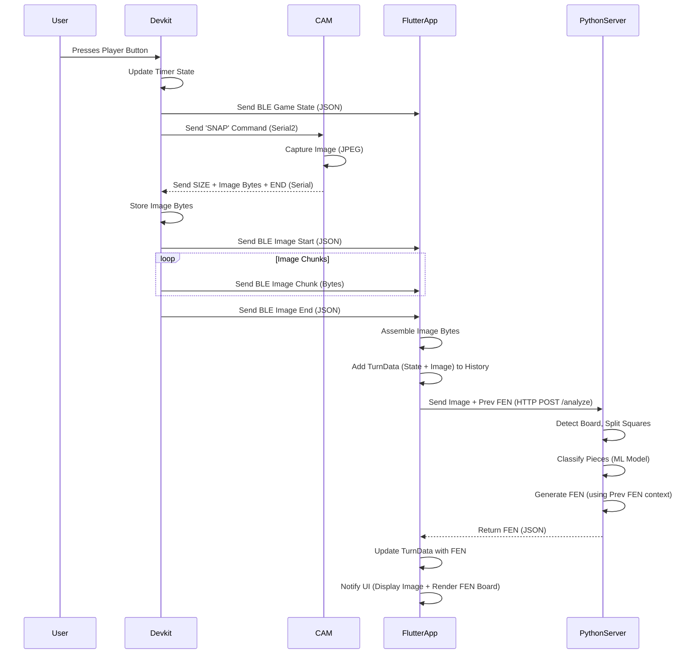

# Project Specifications: Chess Clock Companion

**Version:** 1.0
**Last Updated:** [Date - Placeholder]

## 1. Overview

This project implements a smart chess clock system consisting of interconnected hardware and software components. The system tracks game time using physical buttons, captures images of the chessboard after each turn, analyzes the images to determine the board state (FEN notation), and displays the game progress and board state history on a companion mobile application.

## 2. System Architecture

The system comprises three main components:

1.  **Arduino Hardware (ESP32 Devkit + ESP32 CAM):** The physical chess clock. Manages game timing, button inputs, LCD display, communication with the ESP32 CAM, and Bluetooth Low Energy (BLE) communication with the Flutter app.
2.  **Flutter Mobile Application (`chess_companion`):** Connects to the Arduino hardware via BLE. It receives game state updates and board images, displays them, sends images to the Python server for analysis, receives the resulting FEN, and renders the board state. It also maintains a history of turns and completed games.
3.  **Python Backend Server (`vision_server` + `vision` library):** A Flask web server with computer vision capabilities. It receives chessboard images from the Flutter app, processes them using OpenCV and a pre-trained Keras/TensorFlow model to identify piece positions, and generates the standard Forsyth–Edwards Notation (FEN) string representing the board state.

**Data Flow Diagram:**

## 3. Hardware Component (Arduino - `src/`)

### 3.1. Components

*   **ESP32 DevKit:** Main microcontroller. Runs `src/devkit_hub/main.cpp`.
*   **ESP32 CAM (AI-Thinker):** Camera module. Runs `src/cam_camera/main.cpp`.
*   **LCD Display:** 16x2 I2C LCD (Address `0x27`). Optional, enabled via `USE_LCD` macro in `devkit_hub/main.cpp`.
*   **Push Buttons (3):** Connected to Devkit for Player 1, Player 2, and Reset.

### 3.2. Circuit Connections (Inferred from `src/devkit_hub/main.cpp`)

*   **Buttons:**
    *   Reset Button <-> Devkit GPIO 4 (+ GND)
    *   Player 1 Button <-> Devkit GPIO 18 (+ GND)
    *   Player 2 Button <-> Devkit GPIO 19 (+ GND)
    *   *Note: Uses internal pull-ups (`INPUT_PULLUP`). Buttons should connect the pin to GND when pressed.*
*   **LCD Display (I2C):**
    *   LCD SDA <-> Devkit GPIO 21
    *   LCD SCL <-> Devkit GPIO 22
    *   LCD VCC <-> 3.3V / 5V (Check LCD spec)
    *   LCD GND <-> GND
*   **ESP32 CAM Communication (Serial):**
    *   Devkit GPIO 17 (Serial2 TX) -> CAM GPIO 3 (UART0 RX)
    *   Devkit GPIO 16 (Serial2 RX) <- CAM GPIO 1 (UART0 TX)
    *   CAM 5V <-> 5V Power Source
    *   CAM GND <-> GND
*   **Power:** Both ESP32s require appropriate power (e.g., via USB or 3.3V/5V pins). Ensure sufficient current, especially for the CAM.

### 3.3. Firmware (`src/devkit_hub/main.cpp`)

*   **Functionality:**
    *   Initializes hardware (Buttons, LCD, Serial2 for CAM, BLE).
    *   Manages game state machine (`IDLE`, `RUNNING_P1`, `RUNNING_P2`, `GAME_OVER`).
    *   Tracks player times (`player1Time`, `player2Time`).
    *   Handles button presses (with debouncing) to control game state (`resetGame`, `startGame`, `switchPlayer`).
    *   Updates the LCD display with current times and state (if `USE_LCD` is 1).
    *   Implements BLE server functionality (see Section 5).
    *   Communicates with the CAM via Serial2 to request and receive images (see Section 6).
    *   Sends game state and image data over BLE to the connected Flutter app.
*   **Libraries:** `Arduino.h`, `Wire.h`, `LiquidCrystal_I2C.h`, `BLEDevice.h`, `HardwareSerial.h`.

### 3.4. Firmware (`src/cam_camera/main.cpp`)

*   **Functionality:**
    *   Initializes the OV2640 camera sensor (AI-Thinker pinout).
    *   Configures camera settings (QVGA resolution, JPEG format).
    *   Listens for commands on its primary Serial port (UART0, connected to Devkit's Serial2).
    *   Upon receiving `"SNAP\n"`:
        *   Captures a camera frame buffer (`camera_fb_t`).
        *   If successful, sends `SIZE:<byte_count>\n`, followed by the raw JPEG image bytes, followed by `FRAME_END\n`.
        *   If failed, sends `ERROR:CaptureFail\n`.
*   **Libraries:** `Arduino.h`, `esp_camera.h`.

## 4. Mobile Application Component (`chess_companion/`)

### 4.1. Technology

*   **Framework:** Flutter
*   **Language:** Dart

### 4.2. Key Libraries

*   `flutter_blue_plus`: For BLE communication.
*   `provider`: For state management (`BleService`).
*   `permission_handler`: For requesting BLE/Location permissions.
*   `device_info_plus`: For SDK version check for permissions.
*   `http`: For communication with the Python backend.
*   `flutter_chess_board`: For rendering the chessboard from FEN strings.
*   `json`: For decoding JSON data from BLE.
*   `typed_data`: For handling image byte buffers.

### 4.3. Core Logic (`lib/ble_service.dart`)

*   Manages BLE connection lifecycle (scanning, connecting, disconnecting).
*   Handles BLE permissions specific to Android versions.
*   Discovers the required BLE service and characteristic.
*   Subscribes to and processes notifications from the ESP32 Devkit.
*   Parses game state JSON updates, manages local timers, and maintains turn history (`_turnHistory` of `TurnData` objects).
*   Parses image transfer protocol (start marker, data chunks, end marker), assembling `Uint8List` image data.
*   Communicates with the Python backend (`visionServerUrl`):
    *   Sends the assembled image data and the FEN from the previous turn (if available) via HTTP POST to `/analyze`.
    *   Receives the resulting FEN string or error message.
*   Updates the `TurnData` history with the received FEN or error.
*   Uses `ChangeNotifier` to update the UI.
*   Stores history of completed games (`_gameHistoryLog`).

### 4.4. User Interface (`lib/main.dart`)

*   Provides screens for connection management and game display.
*   Displays connection status.
*   Allows initiating BLE scans.
*   When connected:
    *   Shows Player 1 and Player 2 timers, highlighting the active player.
    *   Displays a scrollable history of turns.
    *   Each turn history item (`TurnHistoryCard`) shows:
        *   Turn number.
        *   Player times at the end of the turn.
        *   The image captured by the ESP32 CAM for that turn.
        *   A rendered chessboard corresponding to the FEN received from the Python server for that turn.
*   Provides a button to navigate to a screen showing completed game logs.
*   Provides a button to disconnect from the BLE device.

## 5. Bluetooth Low Energy (BLE) Communication

*   **Specification:** Defined in `BLE_SPECS.md`.
*   **Device Name:** `ChessClock`
*   **Service UUID:** `4fafc201-1fb5-459e-8fcc-c5c9c331914b`
*   **Characteristic UUID:** `beb5483e-36e1-4688-b7f5-ea07361b26a8`
*   **Properties:** `READ`, `WRITE`, `NOTIFY`
*   **Usage:**
    *   Flutter app enables notifications.
    *   ESP32 Devkit sends notifications containing either:
        *   **Game State:** JSON string `{"player_moved": <0|1|2>, "p1_time_sec": <int>, "p2_time_sec": <int>}`
        *   **Image Start:** JSON string `{"type":"image_start","size":<int>}`
        *   **Image Data:** Raw JPEG bytes (chunked, up to MTU size limit - likely ~20 bytes per notification in firmware).
        *   **Image End:** JSON string `{"type":"image_end"}`
    *   Image transfer notifications follow immediately after a game state notification.

## 6. ESP32 Devkit <-> ESP32 CAM Communication

*   **Interface:** Hardware Serial (UART)
    *   Devkit uses `Serial2` (Pins 16 RX, 17 TX).
    *   CAM uses `Serial` (UART0 - Pins 3 RX, 1 TX).
*   **Baud Rate:** 115200
*   **Protocol:**
    1.  Devkit sends command `SNAP\n` (Note: Devkit code actually sends `T\n`, CAM expects `SNAP\n`. Assuming `SNAP\n` is correct based on CAM code).
    2.  CAM responds with:
        *   `SIZE:<byte_count>\n`
        *   `<byte_count>` raw JPEG bytes
        *   `FRAME_END\n`
    3.  Or, on failure: `ERROR:CaptureFail\n`

## 7. Python Backend (`vision_server/`, `vision/`)

### 7.1. Technology

*   **Framework:** Flask
*   **Language:** Python
*   **Computer Vision:** OpenCV (`opencv-python`)
*   **Machine Learning:** Keras/TensorFlow (`tensorflow`)
*   **Chess Logic:** `python-chess`

### 7.2. Setup

*   Requires Python environment with dependencies from `vision_server/requirements.txt`.
*   Requires a pre-trained Keras model file (`model_weights.h5`) placed in a `models/` directory at the project root. The model is expected to be compatible with the architecture defined in `vision/piece_recognizer.py` (likely sourced from Rizo-R/chess-cv).

### 7.3. API Endpoint

*   **Route:** `/analyze`
*   **Method:** `POST`
*   **Request:** `multipart/form-data`
    *   `file`: Image file (JPEG expected) of the chessboard.
    *   `previous_fen` (optional): FEN string of the board state *before* the current image was taken.
*   **Response:**
    *   **Success (200 OK):** JSON `{"fen": "<generated_fen_string>"}`
    *   **Client Error (400 Bad Request):** JSON `{"error": "<message>"}` (e.g., missing file, invalid FEN format).
    *   **Server Error (400/500 Internal Server Error):** JSON `{"error": "<message>"}` (e.g., board not detected, classification error, invalid generated FEN).

### 7.4. Image Processing Pipeline (`vision/`)

1.  **Load Image:** Decode image bytes received in the request.
2.  **Board Detection (`board_detector.py`):**
    *   Convert to grayscale, blur, adaptive threshold.
    *   Find contours, identify the largest.
    *   Approximate contour/hull to find 4 corners.
    *   Apply perspective warp to get a top-down view (400x400 px).
    *   Split the warped image into 64 squares (50x50 px each).
3.  **Piece Classification (`piece_recognizer.py`):**
    *   For each of the 64 square images:
        *   Resize the square to the model's input size (300x150).
        *   Normalize pixel values.
        *   Feed into the pre-loaded Keras CNN model.
        *   Determine the most likely class (0-12).
        *   Map the class index to a piece symbol (`'P'`, `'n'`, `None`, etc.) using `CLASS_MAP`.
4.  **FEN Generation (`fen_generator.py`):**
    *   Assemble the piece placement part of the FEN from the 64 classifications.
    *   If `previous_fen` was provided:
        *   Parse it using `python-chess`.
        *   Determine `side_to_move` (flip previous).
        *   Attempt to determine `castling_rights`, `halfmove_clock`, `fullmove_number` based on comparison and rules (with known limitations/inaccuracies, especially for castling, halfmove, and en passant).
    *   If `previous_fen` was not provided or invalid, use default values.
    *   Combine all parts into the full FEN string.
    *   Validate the generated FEN using `python-chess`.
    *   Return the (potentially validated) FEN string.

## 8. Dependencies and Setup Notes

*   **Arduino:** Requires ESP32 board support package in Arduino IDE or PlatformIO. Libraries mentioned in section 3.3/3.4 need to be installed.
*   **Flutter:** Requires Flutter SDK installed. Run `flutter pub get` in `chess_companion/`. Requires configuration of `visionServerUrl` in `lib/ble_service.dart` (e.g., using ngrok for local development).
*   **Python:** Requires Python 3.x. Install dependencies using `pip install -r vision_server/requirements.txt`. Requires downloading `model_weights.h5` and placing it in `models/model_weights.h5`. Server runs via `python vision_server/app.py`.

## 9. Potential Issues & Future Improvements

*   **FEN Context Accuracy:** Determining castling rights, halfmove clock, and en passant purely from board state and previous FEN is unreliable. A more robust solution would involve detecting the *actual move* made.
*   **BLE Transfer Speed:** Sending images over BLE can be slow, especially for higher resolutions. QVGA is used currently.
*   **Vision Model Accuracy:** The accuracy of the piece recognition model directly impacts FEN generation. The model requires `model_weights.h5`.
*   **Board Detection Robustness:** Vision can fail if lighting is poor, the board is obscured, or angles are extreme. Debug images are saved by `board_detector.py` on failure.
*   **Error Handling:** Robustness can be improved across all components, especially handling BLE disconnects, server errors, and vision failures gracefully in the Flutter app.
*   **Camera Quality:** Ensure ESP32 CAM focus and lighting are adequate for recognition. 